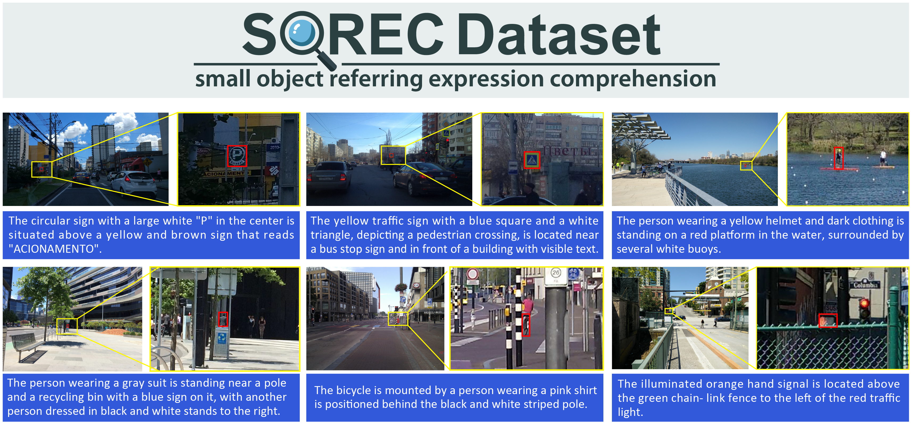
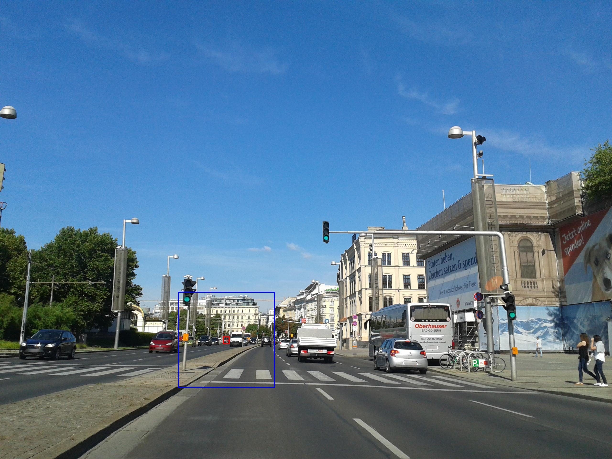
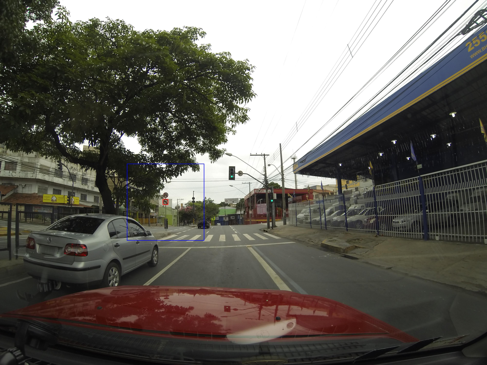
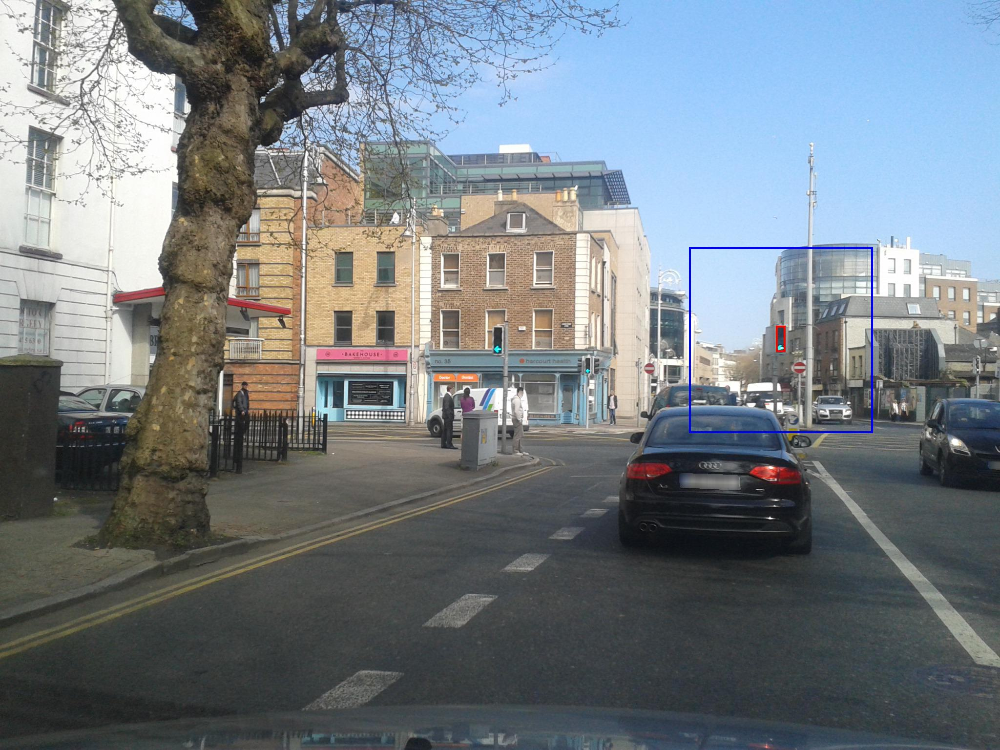

# Referring Expression Comprehension for Small Objects



## 📝 Abstract

Referring expression comprehension (REC) aims to localize the target object described by a natural language expression.
Recent advances in vision-language learning have led to significant performance improvements in REC tasks.
However, localizing extremely small objects remains a considerable challenge despite its importance in real-world applications such as autonomous driving.
To address this issue, we introduce a novel dataset and method for REC targeting small objects.
First, we present the small object REC (SOREC) dataset, which consists of 100,000 pairs of referring expressions and corresponding bounding boxes for small objects in driving scenarios.
Second, we propose the progressive-iterative zooming adapter (PIZA), an adapter module for parameter-efficient fine-tuning that enables models to progressively zoom in and localize small objects.
In a series of experiments, we apply PIZA to GroundingDINO and demonstrate a significant improvement in accuracy on the SOREC dataset. This repository contains our dataset and code.

## SOREC dataset

The SOREC dataset consists of 100,000 pairs of referring expressions and corresponding bounding boxes for small objects in road, highway, rural, and off-road images. You can download json files from the links below:

- 📂 [Train-S](./dataset/sorec/trainS.json): Small training dataset (10,000 referring expressions)
- 📂 [Train-L](./dataset/sorec/trainL.json): Training dataset (61,369 referring expressions)
- 📂 [Val](./dataset/sorec/val.json): Validation dataset (10,712 referring expressions)
- 📂 [Test-A](./dataset/sorec/testA.json): Test dataset for traffic objects (10,815 referring expressions)
- 📂 [Test-B](./dataset/sorec/testB.json): Test dataset for other objects (17,104 referring expressions)
- Please download images from [SODA-D dataset](https://shaunyuan22.github.io/SODA/)

Each entry in the JSON file consists of the following fields:

- 🖼️ image: File name of the image being annotated.
- 🚗 bbox: Bounding box of the target object in the image. It is represented as an array of four integers in the format `[x, y, width, height]`.
- 📝 ref: Textual reference expression that describes the target object within the image.

 ```json
    {
        "image": "10849.jpg",
        "bbox": [
            1011,
            1056,
            21,
            39
        ],
        "ref": "The blue parking sign with white text reading P in white is situated above and to the left of the blue informational sign."
    },
```


## PIZA fine-tuning

### 🛠️ Install
```bash
conda create --name sorec python=3.8 -y
conda activate sorec

# Install mmcv
cd your_workspace
git clone https://github.com/open-mmlab/mmcv.git
cd mmcv
git checkout refs/tags/v2.1.0
pip install -r requirements/optional.txt
pip install -e . -v 

# Install supporting libraries
conda install pytorch==2.1.0 torchvision torchaudio pytorch-cuda=12.1 -c pytorch -c nvidia
pip install fsspec
pip install -U openmim
mim install mmengine

# Set up this project
cd your_workspace/sorec
pip install -v -e .

# Download the GroundingDINO zeroshot model
wget https://download.openmmlab.com/mmdetection/v3.0/mm_grounding_dino/grounding_dino_swin-t_pretrain_obj365_goldg_grit9m_v3det/grounding_dino_swin-t_pretrain_obj365_goldg_grit9m_v3det_20231204_095047-b448804b.pth
```

### ⚙️ Demo

```bash
python demo.py --img resources/sorec/sample.jpg --ref "The red car is positioned between a black car on its left and a white van on its right, driving on a multi-lane road with a white building in the background."
```
#### Input


#### Output


#### Other examples
```bash
python demo.py --img resources/sorec/sample_2.jpg --ref "The circular traffic sign with a red border and a black arrow indicating a prohibited left turn is positioned below another similar sign on a pole, with buildings and power lines in the background."
```


```bash
python demo.py --img resources/sorec/sample_3.jpg --ref "The green traffic light is mounted on a pole, positioned above a no-entry sign and next to urban architecture."
```


### Train & Test
Train
```bash
python tools/train.py configs/piza_adapter_grounding_dino/piza_adapter_grounding_dino_swin-t_finetune_5e_sorec.py
```
Test
```bash
python tools/test.py configs/piza_adapter_grounding_dino/piza_adapter_grounding_dino_swin-t_finetune_5e_sorec.py /path/to/checkpoint.pth
```

### 📊 Results

**Train-S**

| Method               | #Params | Test-A mAcc | Test-A Acc50 | Test-A Acc75 | Test-B mAcc | Test-B Acc50 | Test-B Acc75 |
|----------------------|---------|-------------|--------------|--------------|-------------|--------------|--------------|
| Zero-shot            | 0       | 0.3         | 1.0          | 0.1          | 0.0         | 0.2          | 0.0          |
| Full fine-tuning     | 173.0M  | 35.9        | 58.6         | 38.8         | 23.0        | 43.6         | 21.9         |
| CoOp                 | 0.1M    | 24.2        | 40.1         | 25.8         | 15.5        | 29.6         | 14.6         |
| PIZA-CoOp (Ours)     | 0.9M    | 29.4        | 41.2         | 34.2         | 21.9        | 33.8         | 24.3         |
| LoRA                 | 1.3M    | 26.2        | 43.1         | 28.1         | 17.0        | 32.5         | 15.9         |
| PIZA-LoRA (Ours)     | 1.5M    | 33.8        | 46.6         | 39.2         | 25.8        | 38.7         | 28.9         |
| Adapter+             | 3.3M    | 32.0        | 55.0         | 33.3         | 20.3        | 40.4         | 17.9         |
| PIZA-Adapter+ (Ours) | 3.5M    | 43.1        | 59.6         | 50.1         | 30.4        | 45.9         | 34.1         |

**Train-L**

| Method               | #Params | Test-A mAcc | Test-A Acc50 | Test-A Acc75 | Test-B mAcc | Test-B Acc50 | Test-B Acc75 |
|----------------------|---------|-------------|--------------|--------------|-------------|--------------|--------------|
| Zero-shot            | 0       | 0.3         | 1.0          | 0.1          | 0.0         | 0.2          | 0.0          |
| Full fine-tuning     | 173.0M  | 43.8        | 69.6         | 48.0         | 30.5        | 55.6         | 29.8         |
| CoOp                 | 0.1M    | 27.5        | 46.5         | 28.7         | 17.5        | 34.8         | 15.9         |
| PIZA-CoOp (Ours)     | 0.9M    | 33.4        | 46.8         | 38.7         | 24.4        | 37.6         | 26.9         |
| LoRA                 | 1.3M    | 30.7        | 50.2         | 33.0         | 19.7        | 37.3         | 18.8         |
| PIZA-LoRA (Ours)     | 1.5M    | 39.3        | 54.0         | 45.5         | 29.0        | 43.4         | 32.4         |
| Adapter+             | 3.3M    | 40.7        | 65.9         | 44.4         | 27.6        | 51.3         | 26.6         |
| PIZA-Adapter+ (Ours) | 3.5M    | 45.1        | 66.2         | 51.7         | 31.7        | 52.2         | 33.6         |


## Acknowledgements


- GroundingDINO [https://github.com/IDEA-Research/GroundingDINO](https://github.com/IDEA-Research/GroundingDINO)

```bibtex
@inproceedings{liu2024grounding,
      title={Grounding dino: Marrying dino with grounded pre-training for open-set object detection},
      author={Liu, Shilong and Zeng, Zhaoyang and Ren, Tianhe and Li, Feng and Zhang, Hao and Yang, Jie and Li, Chunyuan and Yang, Jianwei and Su, Hang and Zhu, Jun and others},
      booktitle={Proceedings of the European Conference on Computer Vision (ECCV)},
      year={2024}
}
```

- Adapter+: [https://github.com/visinf/adapter_plus](https://github.com/visinf/adapter_plus)

```bibtex
@inproceedings{Steitz:2024:ASB,
      author={Steitz, Jan-Martin O. and Roth, Stefan},
      title={Adapters Strike Back},
      booktitle = {Proceedings of the IEEE/CVF Conference on Computer Vision and Pattern Recognition (CVPR)},
      year={2024},
      pages={23449--23459}
}
```


- SODA-D dataset: [https://shaunyuan22.github.io/SODA/](https://shaunyuan22.github.io/SODA/)

```bibtex
@article{cheng2023towards,
      author={Cheng, Gong and Yuan, Xiang and Yao, Xiwen and Yan, Kebing and Zeng, Qinghua and Xie, Xingxing and Han, Junwei},
      title={Towards Large-Scale Small Object Detection: Survey and Benchmarks}, 
      journal={IEEE Transactions on Pattern Analysis and Machine Intelligence},
      year={2023},
      volume={45},
      number={11},
      pages={13467-13488},
      doi={10.1109/TPAMI.2023.3290594}
}
```

- mmdetection and MMGroundingDINO: [https://github.com/open-mmlab/mmdetection](https://github.com/open-mmlab/mmdetection)

```bibtex
@article{zhao2024open,
      title={An Open and Comprehensive Pipeline for Unified Object Grounding and Detection},
      author={Zhao, Xiangyu and Chen, Yicheng and Xu, Shilin and Li, Xiangtai and Wang, Xinjiang and Li, Yining and Huang, Haian},
      journal={arXiv preprint arXiv:2401.02361},
      year={2024}
}
```

## License
The code and the model weights in this repository is released under the MIT license as found in the [LICENSE file](LICENSE).


## Citation

Please cite this repository as bellow.
```

```